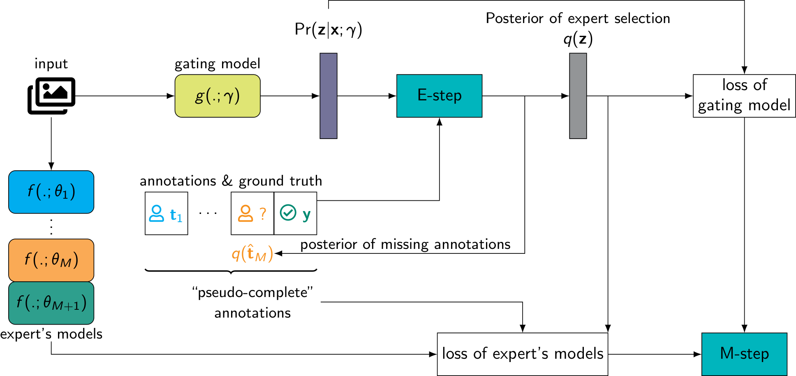

[](https://opensource.org/licenses/MIT)

## Probabilistic learning to defer

This repository provides an implementation of **Probabilistic Learning to Defer: Handling Missing Expert Annotations and Controlling Workload Distribution** presented (as an oral paper:speaking_head: :microphone:) at ICLR 2025 in Singapore :singapore:.


*The visualisation of the proposed Prob-L2D in which the EM algorithm is used to infer the missing annotations of each sample.*


### Contributions of the paper

 - relax the strong assumption requiring: for any sample in the training set, **every human expert must annotate** :fast_forward: **some do annotate, while the others do not**, and apply the EM algorithm to optimise an L2D system in that setting, and
 - integrate a workload constraint into the E-step to distribute workload across all human experts, making the system closely aligned with the one in practice (i.e., every human expert has similar workload).


### Requirements of the implementation

 - implementation is written in [Jax](http://jax.readthedocs.io/),
 - data loading is handled by [Grain](https://google-grain.readthedocs.io/en/latest/), and
 - configuration is specified in [Hydra](https://hydra.cc/).

Please refer to `apptainer.def` for the detailed setup of the python environment in Apptainer :shipit:.

> :memo: The reason that the implementation relies on Google-ecosystem Jax is because Jax does provide flexible optimisation library (e.g., [jaxopt](https://jaxopt.github.io/stable/)) compared to other frameworks (e.g., [Pytorch](https://pytorch.org)).

> :whale2: The reason using Apptainer as the container instead of docker is because setting up Apptainer is more straight-forward to non software-engineering researchers.


### Data setup

The training and evaluation data is specified through json files. Each json file has a similar structure as follows:

```bash
[
    {
        "file": "train/19/bos_taurus_s_000507.png",
        "label": 19
    },
    {
        "file": "train/29/stegosaurus_s_000125.png",
        "label": 29
    },
    {
        "file": "train/0/mcintosh_s_000643.png",
        "label": 0
    },
    {
        "file": "train/11/altar_boy_s_001435.png",
        "label": 11
    }
]
```
Note that the key `file` in each json file represents the relative link of each sample. It is concatenated with the `root` specified in the `<dataset_name>.yaml` under the `dataset` to form the absolute path to each sample. One could modify the class `ImageDataSource` in `utils.py` to adapt to their own data.


### Running

Please make approriate changes in the `conf.yaml` and `conf/<dataset_name>.yaml` files before executing `run.sh`, or simply running the following command on your terminal:

```bash
python3 "main.py"
```


### Tracking, monitoring and managing experiments

Experiments is monitored and managed in MLFlow. To accesss the management portal, run `mlflow_server.sh` (default is port 5000) and open a browser at `localhost:5000`.


### Citation

If you feel this repository useful :ok_hand:, please give a :star: to motivate my work. You could also cite the paper as follows:

```bibtex
@inproceedings{nguyen2025probabilistic,
    title={Probabilistic Learning to Defer: Handling Missing Expert Annotations and Controlling Workload Distribution},
    author={Nguyen, Cuong and Do, Toan and Carneiro, Gustavo},
    booktitle={The Thirteenth International Conference on Learning Representations},
    year={2025},
    url={https://openreview.net/forum?id=zl0HLZOJC9}
}
```

### Acknowledgement

This study is a part of the [PecMan](https://sites.google.com/view/pecmanproject/home) project which is funded by the Engineering and Physical Sciences Research Council (EPSRC) - UK Research and Innovation (UKRI) :gb:.